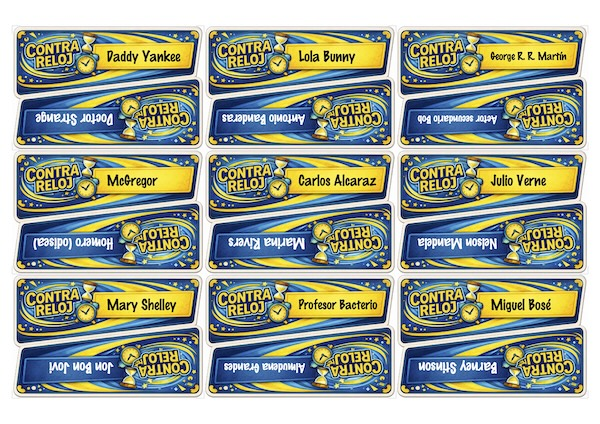

# Time's Up!

El objetivo es producir los materiales necesarios para jugar a partir de una lista de personajes.

## Contenido

- Código y recursos para generar los naipes

## Uso

Crea un listado de personajes en un archivo de texto y ejecuta el siguiente comando:

```sh
node index.js personajes.txt print.pdf
```

## Ejemplo



## Nota

Este repositorio es un experimento de generacion asistida por IA y no es una version oficial del juego.
